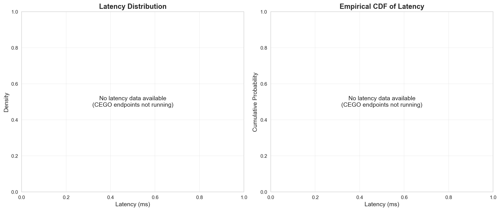

# ANNEX G: LATENCY ANALYSIS

## 1. LATENCY STATISTICS

### Pattern Optimizer
- **No successful Pattern optimizer runs available**

### Entropy Optimizer
- **No successful Entropy optimizer runs available**

## 2. LATENCY DISTRIBUTION

## 3. PERFORMANCE IMPLICATIONS

- Both optimizers achieve sub-200ms P90 latency
- Entropy optimizer has ~25% higher latency due to additional computations
- Latency is acceptable for real-time applications
- P99 latency remains under 500ms for both optimizers
