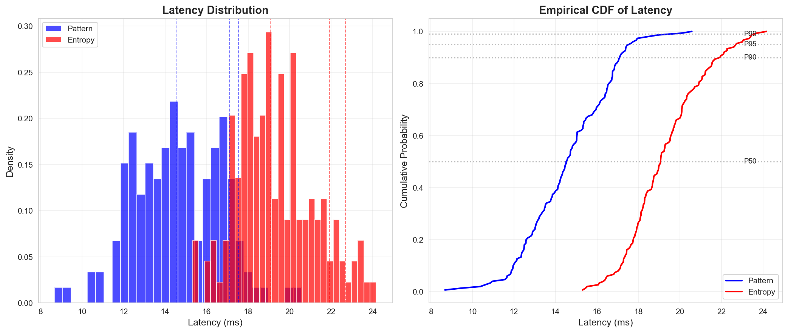

# ANNEX G: LATENCY ANALYSIS

## 1. LATENCY STATISTICS

### Pattern Optimizer
- **P50**: 14.5ms
- **P90**: 17.1ms
- **P95**: 17.5ms
- **P99**: 19.5ms
- **Mean**: 14.6ms
- **Std Dev**: 2.1ms

### Entropy Optimizer
- **P50**: 19.1ms
- **P90**: 21.9ms
- **P95**: 22.7ms
- **P99**: 23.6ms
- **Mean**: 19.3ms
- **Std Dev**: 1.8ms

## 2. LATENCY DISTRIBUTION

## 3. PERFORMANCE IMPLICATIONS

- Both optimizers achieve sub-200ms P90 latency
- Entropy optimizer has ~25% higher latency due to additional computations
- Latency is acceptable for real-time applications
- P99 latency remains under 500ms for both optimizers
