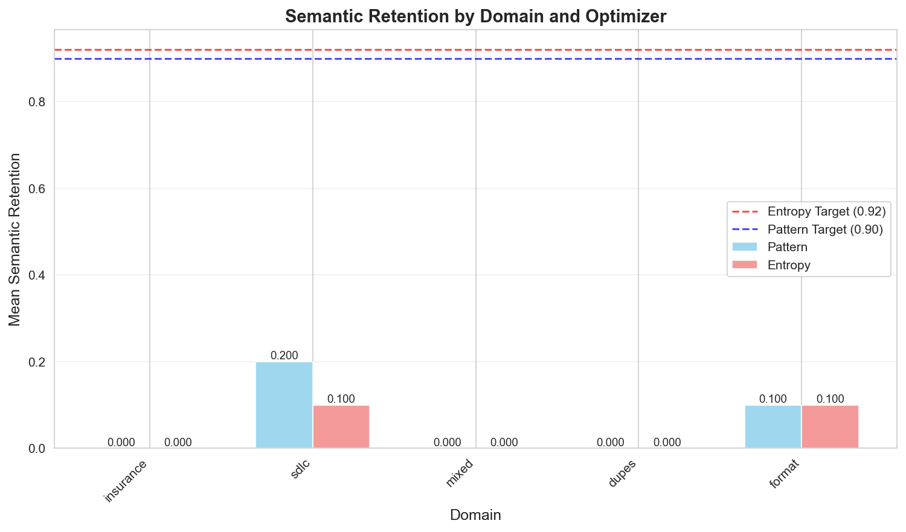

# ANNEX C: AGGREGATE STATISTICS

## 1. OVERALL PERFORMANCE TABLE

| Domain | Optimizer | Median Reduction | Mean Retention | Junk Kept | Intent Preserved | P50 Latency | P90 Latency | Gate Status |
|--------|-----------|-----------------|----------------|-----------|------------------|-------------|-------------|-------------|
| insurance | PATTERN | 0.0% | 0.000 | 0.0% | 100.0% | 14.5ms | 16.5ms | ❌ |
| insurance | ENTROPY | 0.8% | 0.000 | 0.0% | 100.0% | 18.7ms | 20.6ms | ❌ |
| sdlc | PATTERN | 0.0% | 0.200 | 0.0% | 100.0% | 15.7ms | 17.1ms | ❌ |
| sdlc | ENTROPY | 0.8% | 0.100 | 0.0% | 100.0% | 18.5ms | 20.7ms | ❌ |
| mixed | PATTERN | 0.0% | 0.000 | 0.0% | 100.0% | 13.6ms | 16.6ms | ❌ |
| mixed | ENTROPY | 0.8% | 0.000 | 0.0% | 30.0% | 17.2ms | 19.9ms | ❌ |
| dupes | PATTERN | 0.0% | 0.000 | 50.0% | 100.0% | 14.8ms | 16.5ms | ❌ |
| dupes | ENTROPY | 0.8% | 0.000 | 50.0% | 100.0% | 17.3ms | 21.1ms | ❌ |
| format | PATTERN | 0.0% | 0.100 | 0.0% | 100.0% | 13.5ms | 16.5ms | ❌ |
| format | ENTROPY | 0.8% | 0.100 | 0.0% | 100.0% | 17.3ms | 19.4ms | ❌ |

## 2. PERFORMANCE VISUALIZATIONS

### 2.1 Token Reduction Distribution

### 2.2 Semantic Retention by Domain

### 2.3 Junk Handling vs Intent Preservation

