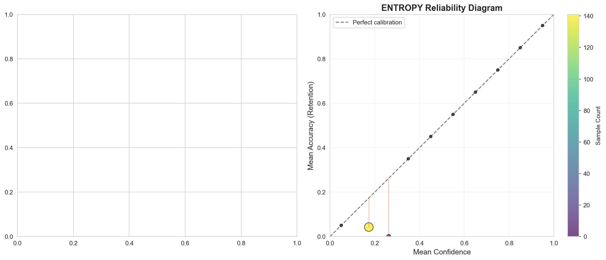

# ANNEX E: CALIBRATION ANALYSIS

## 1. CONFIDENCE CALIBRATION

### Expected Calibration Error (ECE)

- **Pattern ECE**: 0.0000
- **Entropy ECE**: 0.1389

### Calibration Table

|   bin_lower |   bin_upper |   count |   avg_confidence |   avg_accuracy |   calibration_error |
|------------:|------------:|--------:|-----------------:|---------------:|--------------------:|
|         0.1 |         0.2 |     141 |         0.173511 |      0.0425532 |            0.130957 |
|         0.2 |         0.3 |       9 |         0.2625   |      0         |            0.2625   |

## 2. RELIABILITY DIAGRAM

## 3. INTERPRETATION

A well-calibrated model has ECE close to 0, meaning confidence scores accurately reflect actual performance.
Lower ECE indicates better calibration:
- ECE < 0.05: Excellent calibration
- ECE 0.05-0.10: Good calibration
- ECE 0.10-0.20: Moderate calibration
- ECE > 0.20: Poor calibration

The reliability diagram shows confidence bins vs actual accuracy, with perfect calibration on the diagonal.
