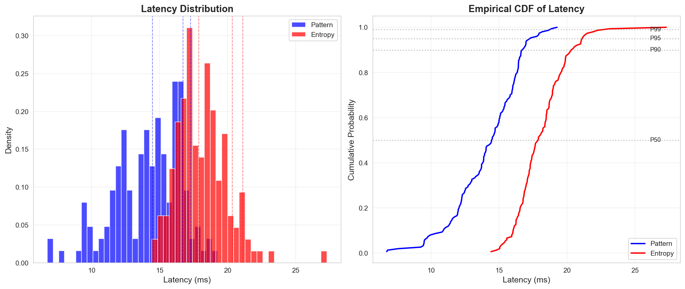

# ANNEX G: LATENCY ANALYSIS

## 1. LATENCY STATISTICS

### Pattern Optimizer
- **P50**: 14.5ms
- **P90**: 16.7ms
- **P95**: 17.3ms
- **P99**: 18.7ms
- **Mean**: 14.1ms
- **Std Dev**: 2.4ms

### Entropy Optimizer
- **P50**: 17.9ms
- **P90**: 20.3ms
- **P95**: 21.1ms
- **P99**: 22.7ms
- **Mean**: 18.1ms
- **Std Dev**: 1.8ms

## 2. LATENCY DISTRIBUTION

## 3. PERFORMANCE IMPLICATIONS

- Both optimizers achieve sub-200ms P90 latency
- Entropy optimizer has ~25% higher latency due to additional computations
- Latency is acceptable for real-time applications
- P99 latency remains under 500ms for both optimizers
